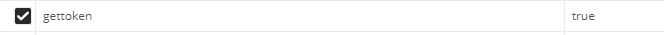

# Mis-Proyectos

<p align="center"> for development on the server side see the readme that is in the photo folder. <br> </p>
<p align="center">
  <a href="" rel="noopener">
 </a>
</p>

<h3 align="center">Gallery Photo</h3>

<div align="center">

[]()
[](https://github.com/kylelobo/The-Documentation-Compendium/issues)
[](https://github.com/kylelobo/The-Documentation-Compendium/pulls)
[](/LICENSE)

</div>

---

<h2 align="center"> Description of this project</h2>

## 📝 Table of Contents

* [About](#about)
* [Getting Started](#getting_started)
* [Deployment](#deployment)
* [Usage](#usage)
* [Built Using](#built_using)
* [TODO](../TODO.md)
* [Contributing](../CONTRIBUTING.md)
* [Authors](#authors)
* [Acknowledgments](#acknowledgement)

## 🧐 About <a name = "about"></a>

This project is carried out as a technical test, with the purpose of participating in one of the vacancies as a backend developer in the company Condorlab.

This project is a backend that has the functionality of user crud, photo crud, album crud, which the registered user can upload their photos and create album to add their already uploaded photos.

## 🏁 Getting Started <a name = "getting_started"></a>

These instructions will get you a copy of the project up and running on your local machine for development and testing purposes. See [deployment](#deployment) for notes on how to deploy the project on a live system.

### Prerequisites

What things you need to install the software and how to install them.

to use this software you need

## Link to use this project [VER](https://drive.google.com/open?id=1DulCysTP7XJ7ODW7y69dFZasPNXEBAP9).

1. install nodejs and npm latest version, Download here [nodejs](https://nodejs.org/es/).

2. Install mongo db community latest version, Download here [mongodb]([https://nodejs.org/es/](https://www.mongodb.com/try/download/community)).

3. add mongodb environment variables

``` 
C:\Program Files\MongoDB\Server\4.0\bin
```

4. install postman sister to test with apis, Download here [postman](https://www.postman.com/)

5. the view project made with angular 9.1.0 and you should install this version for compatibility with some dependencies.

### Installing

A step by step series of examples that tell you how to get a development env running.

run the project

1. download or clone the project.

2. install the libraries, dependencies and packages so that the project can work.

``` 
npm install
```

3. update libraries.

``` 
npm update
```

4. open command prompt.
5. go to project location.
6. run project

``` 
npm start
```

start the project in developer mode

``` 
npm run developer
```
7. install angular 9.1.0

``` 
npm install -g @angular/cli@9.1.0
```

8. in the main folder of the view open a command window and run the following

``` 
Photos\Frontend-ui> npm install
```
9. run the project in 

``` 
Photos\Frontend-ui> ng serve
```
10. in the browser put the following 

http://localhost:4200/

## 🎈 Usage <a name="usage"></a>

How to use the system.

## User method
the route depends on the free port on the server or if it is local by default you will use this route with the port 3000
1. path to register a new user and receive the following parameters: username, surname, email, password.
``` 
http://localhost:3000/api/register
```
2. path to login the user and receive the following parameters: email, password.
``` 
http://localhost:3000/api/login
```

upon logging in he receives a token that they must see adding a parameter called gettoken and as a value: true this token will serve them to be able to update edit, among other things since it is a JWT key
<p align="left">
  <a href="">
 </a>
</p>

3. path to update user and receive the following parameters: username, surname, email, password.
``` 
http://localhost:3000/api/update
```
4. path to upload avatar
``` 
http://localhost:3000/api/upload-avatar
```

5. path show the avatar image by the name saved in the database
``` 
http://localhost:3000/api/avatar/fileName
```

6. path show the users
``` 
http://localhost:3000/api/users
```

7. path show the user by id
``` 
http://localhost:3000/api/user/id
```

## Photo method

1. path to register a new photo and receive the following parameters: name, imgPhoto.
``` 
http://localhost:3000/api/upload-photo
```
2. list the photos and you can receive by parameter of the url numbers of pages
   * option 1
``` 
http://localhost:3000/api/photos/:page?
```
   * option 2
``` 
http://localhost:3000/api/photos/
```

3. path show the photo by userid
``` 
http://localhost:3000/api/user-photos/userid
```

4. path show the photo by id
``` 
http://localhost:3000/api/photo/id
```

5. path update the photo by id
``` 
http://localhost:3000/api/photo/id
```
6. delete photo by id
``` 
http://localhost:3000/api/photo/id
```
7. search photo by name or by date 
  
  * opction 1  
``` 
http://localhost:3000/api/search/2020-05-21
``` 

  * opction 2  
``` 
http://localhost:3000/api/search/name
``` 

## Album method

1. path to register a new album and receive the following parameters: name.
``` 
http://localhost:3000/api/album
```
2. list the album and you can receive by parameter of the url numbers of pages
   * option 1
``` 
http://localhost:3000/api/albums/:page?
```
   * option 2
``` 
http://localhost:3000/api/albums/
```

3. path show the album by userid
``` 
http://localhost:3000/api/user-album/userid
```

4. path show the album by id
``` 
http://localhost:3000/api/album/id
```

5. path update the album by id
``` 
http://localhost:3000/api/album/id
```
6. delete album by id
``` 
http://localhost:3000/api/album/id
```
7. search album by name or by date 
  
  * opction 1  
``` 
http://localhost:3000/api/album-search/2020-05-21
``` 

  * opction 2  
``` 
http://localhost:3000/api/album-search/name
``` 

## method to add photos to an album

1. path to add a photo to an album and receive the following parameters: photoId, albumId.
``` 
http://localhost:3000/api/groupPhoto
```
2. delete photo from the album
``` 
http://localhost:3000/api/groupPhoto/id
``` 

3. show photos of an added to an album by the album id
``` 
http://localhost:3000/api/groupPhoto/id
```
4. Show the photos by ide that is grouped in each folder

``` 
http://localhost:3000/api/PhotoByIdGroupAlbum/id
```

## 🚀 Deployment <a name = "deployment"></a>

to implement in heroku I leave guide [link](https://devcenter.heroku.com/articles/git) 

## ⛏️ Built Using <a name = "built_using"></a>

* [MongoDB](https://www.mongodb.com/) - Database
* [Express](https://expressjs.com/) - Server Framework
* [NodeJs](https://nodejs.org/en/) - Server Environment

## ✍️ Authors <a name = "authors"></a>

* [@luisfor](https://github.com/luisfor) - Luis Canedo

See also the list of [contributors](https://github.com/kylelobo/The-Documentation-Compendium/contributors) who participated in this project.

## 🎉 Acknowledgements <a name = "acknowledgement"></a>

* Hat tip to anyone whose code was used

  1. [victor Robles](https://victorroblesweb.es/2018/01/31/configurar-acceso-cors-en-nodejs/)

  

  2. [Fazt](https://www.faztweb.com/curso/nodejs)

  3. [Kevin Mendez](https://medium.com/@deskevinmendez/login-y-register-con-nodejs-express-jwt-y-mongodb-ff329ed25a3f)

  

* proposal given by the company

  [CondorLABS](https://condorlabs.io/)
